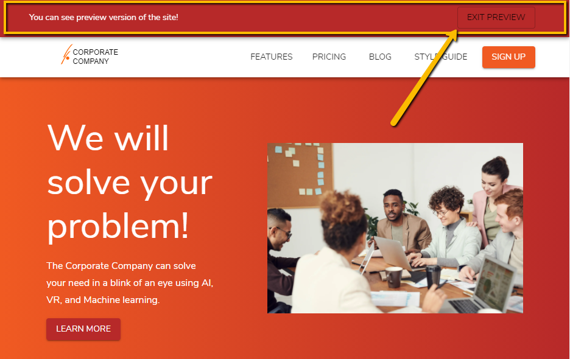

# Kontent Starter Corporate - Next.js

[](https://github.com/Kentico/kontent-starter-corporate-next-js/actions/workflows/main.yml)
[](https://app.netlify.com/sites/kontent-starter-corporate-next-js/deploys)

[](https://github.com/Kentico/Home/discussions)
[](https://stackoverflow.com/tags/kentico-kontent)

This is a [Next.js](https://nextjs.org) corporate starter site using [Kentico Kontent](https://kontent.ai) as a [CMS](https://en.wikipedia.org/wiki/Content_management_system).

> ⚠ This repository is still in the concept phase. There is [a bunch of tasks to be done](https://github.com/Kentico/kontent-starter-corporate-next-js/issues), but if you have any feedback to any part of the code, feel free to raise and issue and let's discuss your ideas.

## Demo

<https://kontent-starter-corporate-next-js.netlify.app/>

[](https://kontent-starter-corporate-next-js.netlify.app)

## Deploy your own

Once you have access to [the environment variables you'll need](#environment-variables), deploy the example using [Vercel](https://vercel.com?utm_source=github&utm_medium=readme&utm_campaign=next-example):

[](https://vercel.com/new/git/external?repository-url=https://github.com/Kentico/kontent-starter-corporate-next-js&project-name=kontent-starter-corporate-next-js&repository-name=kontent-starter-corporate-next-js&env=KONTENT_PROJECT_ID,KONTENT_PREVIEW_API_KEY&envDescription=Required%20to%20connect%20the%20app%20with%20Kontent&envLink=https://github.com/Kentico/kontent-starter-corporate-next-js%23Environment-variables)

## How to use

Execute [`create-next-app`](https://github.com/vercel/next.js/tree/canary/packages/create-next-app) with [npm](https://docs.npmjs.com/cli/init) or [Yarn](https://yarnpkg.com/lang/en/docs/cli/create/) to bootstrap the example:

```bash
npx create-next-app --example https://github.com/Kentico/kontent-starter-corporate-next-js kontent-starter-corporate-next-js
# or
yarn create next-app --example https://github.com/Kentico/kontent-starter-corporate-next-js kontent-starter-corporate-next-js
```

### Environment variables

1. Set up environment variables
    * Copy the `.env.template` file in this directory to `.env` (which will be ignored by Git):

        ```sh
        cp .env.template .env
        ```

1. Run the development server

    ```sh
    npm run dev
    # or
    yarn dev
    ```

🎉 Open [http://localhost:3000](http://localhost:3000) with your browser to see the result.

> By default, the content is loaded from a shared Kentico Kontent project. If you want to use your own clone of the project so that you can customize it and experiment with Kontent, continue to the next section.

## Create your own data source project in Kontent

### Create Kontent project

1. Create an account on Kontent
    * [Create an account on Kontent.ai](https://app.kontent.ai/sign-up?utm_source=nextjs_boilerplate_example&utm_medium=devrel).
2. After signing up, [create an empty project](https://docs.kontent.ai/tutorials/set-up-kontent/projects/manage-projects#a-creating-projects).
3. Go to the "Project Settings", select API keys and copy the following keys for further reference
    * Project ID
    * Management API key
4. Use the [Template Manager UI](https://kentico.github.io/kontent-template-manager/import) for importing the content from [`kontent-backup.zip`](./kontent-backup.zip) file and API keys from previous step. Check *Publish language variants after import* option before import.

    > Alternatively, you can use the [Kontent Backup Manager](https://github.com/Kentico/kontent-backup-manager-js) and import data to the newly created project from [`kontent-backup.zip`](./kontent-backup.zip) file via command line:
    >
    >   ```sh
    >    npm i -g @kentico/kontent-backup-manager
    >    # or
    >    yarn global add @kentico/kontent-backup-manager
    >
    >    kbm --action=restore --projectId=<Project ID> --apiKey=<Management API key> --zipFilename=kontent-backup
    >    ```
    >
    > Go to your Kontent project and [publish the imported items](https://docs.kontent.ai/tutorials/write-and-collaborate/publish-your-work/publish-content-items).

### Connect Kontent project with code base

1. Set env variables on `.env`:
    * `KONTENT_PROJECT_ID` - Should be the Project ID in `Project settings` > `API keys`.
    * `KONTENT_PREVIEW_API_KEY` - Should be the Preview API key in `Project settings` > `API keys`. Set this value if you want to see non-published content. If you need more complex setup, jump to the [Preview section](#Preview).

## Content editing development

Run the development server:

```sh
npm run dev
# or
yarn dev
```

🎉 Open [http://localhost:3000](http://localhost:3000) with your browser to see the result.

You can start editing the page by modifying content in Kentico Kontent project. The page auto-updates as you edit the content. If you don't have `KONTENT_PREVIEW_API_KEY` specified, you need to [publish the changes](https://docs.kontent.ai/tutorials/write-and-collaborate/publish-your-work/publish-content-items) in order to see the changes on site.

## About

This section describes the application from data modeling point of view as well as application architecture approach.

### Content model

Content is modelled to be ready for being used in the [Web Spotlight](webspotlight.kontent.ai). Web spotlight is not turned on by default intentionally, because this starters should also serve to to users without the feature on.


> The screen was taken from [Relations UI](https://docs.kontent.ai/tutorials/write-and-collaborate/structure-your-content/link-related-content-together#a-see-how-your-content-is-linked-together). For better idea, check out the [content type relationships graph](./docs/content-types-relations.png).

### Structural types

The structure of the model is defined by linked items element called "Subpages"

* Homepage - also stores configuration data like color palette, font specification, site logo, or social networks information
  * Navigation Item - mainly for defining the sitemap structure with the slugs.

### Layout types

Content for these structural wrappers is defined by linked items element called "Content" with limitation to exactly one item of the type:

* **Simple page** - This content type is mapped to the [simple_page.js](./layouts/simple_page.js). It is a simple page, containing title, subtitle, image and content.
* **Landing page** - This content type is mapped to the [landing_page.js](./layouts/landing_page.js). The more complex page consists of sections (see [/components/sections](./components/sections)).
* **Listing page** - This content type is mapped to the [listing_page.js](./src/layouts/listing_page.js). This page allows to specify which content types should be listed under it. Currently, the only supported in Post content type.

> These types are then using specific layouts for rendering.

### Turn on Web Spotlight

When you turn on the [Web Spotlight](https://docs.kontent.ai/tutorials/set-up-kontent/set-up-your-project/web-spotlight). New content types ["Homepage" and "Page"](https://docs.kontent.ai/tutorials/set-up-kontent/set-up-your-project/web-spotlight#a-how-web-spotlight-works) will be generated. In order to accommodate the content types, it is required to:

* Remove the Page content type, because its responsibilities are handled by "Navigation Item" content type.
* Transfer content model structure from "old" homepage content type to newly created one. The only difference is the "Subpages" elements that will be modeled by [Subpages](https://docs.kontent.ai/tutorials/set-up-kontent/content-modeling/what-is-content-modeling#a-subpages) element type. It is important to keep the codenames of the element the same
* Transfer the data from old "homepage"
* Remove the the "old" homepage content item and the "old" content type and set the new homepage content item codename to "homepage".

> This step are easily scriptable by creating a migration using [Kontent CLI](https://github.com/Kentico/kontent-cli). To see the progress of including it to this starter, follow [this issue](https://github.com/Kentico/kontent-starter-corporate-next-js/issues/4).

## Code

The application is using Next.js [Catch all route](https://nextjs.org/docs/routing/dynamic-routes#catch-all-routes) to handle all of the routes. The logic in centralized in [`pages/[[...slug]].js`](./src/pages/[[...slug]].js).

### Data loading

#### Sitemap construction

To define the sitemap and its mapping to specific content items a method `getContentPaths` in [lib/api.js](./lib/api.js) is used. Using `getSitemapMappings` method, it loads "homepage" item and its child items to the specific depth and then traverse down. This process creates a mapping between the sitemap (routes) and the content items storing data for the specific route.

#### Specific route data

For every single route, Next.js is loading data using the `getPageStaticPropsForPath` method. Internally, it reloads the site structure via `getSitemapMappings` method and then identifies the content items to load the data. Then loads the data and passes them as the `props` to the react components.

> Currently, the sitemap is reloaded for every request. The following approach was selected because there is currently no way to pass more information than just a path from `getStaticPaths` to `getStaticProps`. See [the official Next.js GitHub discussion comment](https://github.com/vercel/next.js/issues/10933#issuecomment-598297975) for more information.
> It is possible to extend the implementation with the caching, this approach is about to be application specific, so it is not part of the starter.

### Content types - React components mapping

Application is using the codename of the content type to load proper react component and render it. If the application does not find the proper component, it fails or display [special UnknownComponent](./components/UnknownComponent.js) in case od development environment.

```jsx
const componentName = upperFirst(
    camelCase(
        get(section, 'system.type', null)
    )
);

const Component = sections[componentName];

if (process.env.NODE_ENV === 'development' && !Component) {
    console.error(`Unknown section component for section content type: ${contentType}`)
    return (
        <UnknownComponent key={section_idx} {...this.props}>
            <pre>{JSON.stringify(section, undefined, 2)}</pre>
        </UnknownComponent>
    );
}

return <Component key={section_idx} {...props} section={section} />
```

Reference:

* [Layout mapping](./pages/[[...slug]].js)
* [Landing page sections mapping](./layouts/landing_page.js)
* [Footer sections mapping](./components/Footer.js)
* [Thumbnail mapping](./layouts/listing_page.js)

## Preview

Next.js offers embedded possibility to preview unpublished content - [the preview mode](https://nextjs.org/docs/advanced-features/preview-mode). This feature is integrated with [Kontent preview](https://docs.kontent.ai/tutorials/develop-apps/build-strong-foundation/set-up-preview) in this starter. Once the preview is enabled, all api calls are performed to the [Kontent Preview endpoints](https://docs.kontent.ai/reference/delivery-api#section/Production-vs.-Preview).

There are two Next API routes - `/api/preview` and `/api/exit-preview` - that works as described in [Next.js docs](https://nextjs.org/docs/advanced-features/preview-mode).

### Enter the preview

To enter the preview, just access `/api/preview` API route with the preview secret you set in your [environment variables](#environment-variables).

`http://localhost:3000/api/preview?secret=PREVIEW_SECRET`

> If you don't have your `PREVIEW_SECRET`, your preview is not secured and could be accessed by anybody. Read more on [Official Next.js docs](https://nextjs.org/docs/advanced-features/preview-mode#securely-accessing-it-from-your-headless-cms).

Once your secret is verified, you will be redirected to home page and you could see non-published content and the toolbar that allow you to exit the preview.



### Exit the preview

Once the preview is enabled a new toolbar pops up on the top of the page. This allows to to close the preview (the "EXIT PREVIEW" button leads to the `/api/exit-preview` API route).

## Design

The application is using [Material Design](https://material-ui.com/). The main theme is configured in [_app.js](./pages/_app.js). Components are styled using `makeStyles` method to ensure isolation.

```jsx
import React from 'react'
import get from 'lodash.get'
import { Container, makeStyles } from '@material-ui/core';

const useStyles = makeStyles((_theme) => ({
  section: {
    background: 'red'
  }
}));

function FeaturesSection(props) {
  const section = get(props, 'section', null);
  const classes = useStyles();


  return (
    <section id={get(section, 'system.codename', null)} className={classes.section}>
      <Container>
        Section: {get(section, 'system.codename', null)}
      </Container>
    </section>
  )
}

export default FeaturesSection
```

There are some additional steps done to allow [Server rendering](https://material-ui.com/guides/server-rendering/). The concept of the app was used from [Official Next.js example for material design](https://github.com/mui-org/material-ui/tree/master/examples/nextjs).

> Follow [this issue](https://github.com/Kentico/kontent-starter-corporate-next-js/issues/13) to see how to use configurable theme definition in Next.js app.

## Learn More

To learn more about Next.js, take a look at the following resources:

* [Kontent + Next.js blog example](https://github.com/vercel/next.js/tree/canary/examples/cms-kontent#readme) - complex sample project setup including i.e. preview functionality, listing, Tailwind CSS, ...
* [Kontent + Next.js boilerplate](hhttps://github.com/Kentico/kontent-boilerplate-next-js#readme) - Simple boilerplate showcases Next.js static generation feature using Kentico Kontent as the data source.
* [Next.js Documentation](https://nextjs.org/docs) - learn about Next.js features and API.
* [Learn Next.js](https://nextjs.org/learn) - an interactive Next.js tutorial.
* [This Mission: Next.js from the Ground Up](https://explorers.netlify.com/learn/nextjs)

### Related content

* [Using the Next image component with Kentico Kontent assets](https://meeg.dev/blog/using-the-next-image-component-with-kentico-kontent-assets) by [Chris Meagher](https://github.com/CMeeg)
* [Using Azure Pipelines to build and deploy a Next.js app to Azure app services](https://meeg.dev/blog/using-azure-pipelines-to-build-and-deploy-a-next-js-app-to-azure-app-services) by [Chris Meagher](https://github.com/CMeeg)
